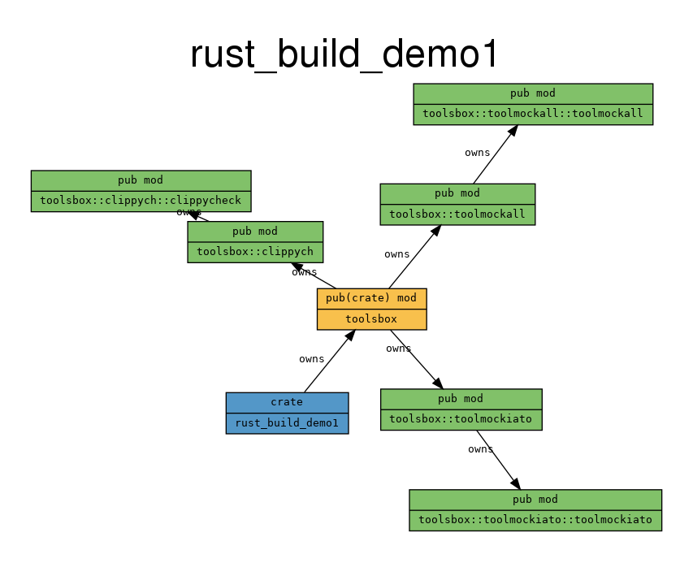
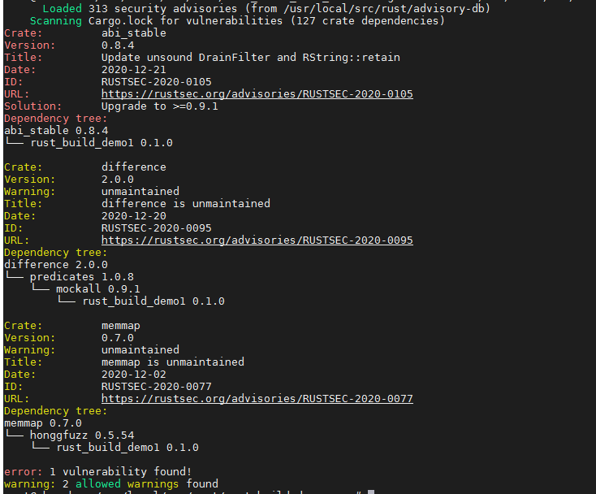

# Rust构建工具链分析
## 1.环境准备


```shell
# 通过rustup安装对应组件
# rustc-dev : 包含hir和ast解析相关的crate
# rust-src :
# clippy : lint检查，代码规范
# rustfmt : 代码格式化
# miri : 实验性mir解释器
# llvm-tools-preview :
rustup component add rustc-dev rust-src clippy rustfmt miri llvm-tools-preview
# 防止失败，关闭编译选项
unset RUSTFLAGS RUSTDOCFLAGS
```

## 2.工具列表

### 2.1cargo-supply-chain

##### 2.1.1功能：

在依赖关系图中收集有关 crate 的作者、贡献者和发布者数据

```shell
Commands:
  publishers   从crates.io查询并展示依赖关系图中的所有发布者
  crates       从crates.io查询并展示依赖图中所有的crate和每个crate的发布者
  json         类似crates，但是以json形式展示每个发布者更多的字段
  update       从crate.io下载最新的存档来加速本工具的其他命令

See 'cargo supply-chain help <command>' 获取特定命令的更多信息

Arguments:
  --cache-max-age  缓存被认为有效的时间，默认48小时，比设定的时间更新，意味着有效
  				   形式如`1w` or `1d 6h`.
  -d, --diffable   通过工具使输出更友好 如`diff`

Any arguments after the `--` will be passed to `cargo metadata`, for example:
  cargo supply-chain crates -- --filter-platform=x86_64-unknown-linux-gnu
See `cargo metadata --help` for a list of flags it supports.
```

```shell
cargo install cargo-supply-chain
# 列出依赖图中所有的crates和每个的发布者
cargo supply-chain update
# 列出依赖图中所有的crates和每个crate的发布者
cargo supply-chain crates
cargo supply-chain publishers
```

##### 2.1.2原理简析：


##### 2.1.3结果展示与分析：


### 2.cargo-geiger

##### 2.2.1功能：

列出与crate及其所有依赖项中unsafe rust使用相关的统计信息。

```
# 需要安装libssl-dev库
sudo apt-get install libssl-dev
cargo install cargo-geiger
cargo geiger
```

##### 2.2.2原理简析：


##### 2.2.3结果展示：


- 


### 3.cargo

##### 2.3.1功能：

**构建命令：**

cargo bench： 编译和执行基准测试。

cargo build：编译本地包及其所有依赖项。

cargo check：检查本地包及其所有依赖项是否有错误。

cargo clean：删除生成的构建缓存。

cargo doc：为本地包和所有依赖项构建文档。以 rustdoc 的常用格式放置在`target/doc`。

cargo fetch：从网络获取包的依赖项。

cargo fix ： 自动修复 rustc 报告的 lint 警告。

cargo run：运行本地包的二进制文件或示例。

cargo rustc：编译当前包，并将额外的选项传递给编译器。

cargo rustdoc：使用指定的自定义标志构建包的文档。

cargo test：执行包的单元和集成测试。

**清单命令：**

.....

cargo-tree：显示依赖图的树形可视化


.....


##### 2.3.2原理简析：


##### 2.3.3结果展示：


### 4.cargo-deps

##### 2.4.1功能：

Cargo 子命令，用于构建 Rust 项目的依赖关系图

```
cargo install cargo-deps
sudo apt install graphviz
cargo deps --all-deps | dot -Tpng > cargo-deps.png
```

##### 2.4.2原理简析：


##### 2.4.3结果展示：


### 5.tokei

##### 2.5.1功能：

Tokei 是一个显示代码统计信息的程序。Tokei 将显示文件数、这些文件中的总行数以及按语言分组的代码、注释和空白。

```
cargo install tokei
tokei
```

##### 2.5.2原理简析：


##### 2.5.3结果展示：


### 6.cargo-udeps

##### 2.6.1功能：

在 Cargo.toml 中查找未使用的依赖项。

```
cargo +stable install cargo-udeps
cargo +nightly udeps --all-targets
```

##### 2.6.2原理简析：


##### 2.6.3结果展示：


### 7.cargo-modules

##### 2.7.1功能：

用于显示crate模块概述的货物插件

```
cargo install cargo-modules
cargo modules generate tree --bin rust_build_demo1 
cargo modules generate graph --bin rust_build_demo1 
```

##### 2.7.2原理简析：


##### 2.7.3结果展示：





### 8.cargo-license

##### 2.8.1功能：

用于查看crate依赖项license的cargo子命令。

```
cargo install cargo-license
cargo license > workplace/cargo-license.txt
```

##### 2.8.2原理简析：


##### 2.83.3结果展示：


### 9.cargo-audit

##### 2.9.1功能：

根据advisory-db数据库中记录的漏洞信息，审计 Cargo.lock 文件中存在安全漏洞的依赖项

```
cargo +stable install --locked cargo-audit
cargo audit --db /usr/local/src/rust/advisory-db --no-fetch
```

##### 2.9.2原理简析：


##### 2.9.3结果展示：



### 10.fmt

##### 2.10.1功能：

代码格式化检查

```
cargo fmt -- --check
```

##### 2.10.2原理简析：


##### 2.10.3结果展示：


### 11.rust-clippy

##### 2.11.1功能：

用于捕获常见错误并改进rust代码的lint集合

| Category              | Description                                                  | Default level |
| --------------------- | ------------------------------------------------------------ | ------------- |
| `clippy::all`         | 默认的所有lints (correctness, suspicious, style, complexity, perf) | **warn/deny** |
| `clippy::correctness` | 检测完全错误或无用的代码                                     | **deny**      |
| `clippy::suspicious`  | 检测很可能是错误或无用的代码                                 | **warn**      |
| `clippy::style`       | 检测应该以更惯用方式编写的代码                               | **warn**      |
| `clippy::complexity`  | 检测做简单的事情但使用复杂实现方法的代码                     | **warn**      |
| `clippy::perf`        | 检测能够运行的更快的代码                                     | **warn**      |
| `clippy::pedantic`    | 相当严格，有可能有假阳性的lints                              | allow         |
| `clippy::nursery`     | 仍在开发中的新lints                                          | allow         |
| `clippy::cargo`       | cargo清单的lints                                             | allow         |

##### 2.11.2原理简析：


##### 2.11.3结果展示：


### 12.cargo deny

##### 2.12.1功能：

```
cargo install --locked cargo-deny
cargo deny check advisories
cargo deny check sources
cargo deny check bans
cargo deny check license
```

##### 2.12.2原理简析：


##### 2.12.3结果展示：


### 13.cargo-strict

##### 2.13.1功能：

检查unwrap函数用法

```
cargo install --git https://github.com/hhatto/cargo-strict.git
cargo strict
```

##### 2.13.2原理简析：


##### 2.13.3结果展示：


### 14.cargo-bloat

##### 2.14.1功能：

找出什么占用了可执行文件中的大部分空间。

**注意：**支持 ELF (Linux, BSD)、Mach-O (macOS) 和 PE (Windows) 二进制文件。

**注意：**不支持 Windows MSVC 目标。见[#17](https://github.com/RazrFalcon/cargo-bloat/issues/17)。

**注意：**不支持 WASM。更喜欢[twiggy](https://github.com/rustwasm/twiggy)。

```
cargo install cargo-bloat
# 检查各个crate在可执行文件的空间占用百分比
cargo bloat --release --crates 
# 检查各个函数在可执行文件的空间占用百分比
cargo bloat --release -n 30
```

##### 2.14.2原理简析：


##### 2.14.3结果展示：


### 15.cargo-llvm-lines

##### 2.15.1功能：

计算泛型函数的所有实例化中 LLVM IR 的行数

```
cargo install cargo-llvm-lines
cargo llvm-lines --bin rust_build_demo1
```

##### 2.15.2原理简析：


##### 2.15.3结果展示：


### 16.cargo-outdated

##### 2.16.1功能：

用于显示Rust过时依赖项的cargo子命令

```
cargo install cargo-outdated
cargo outdated
```

##### 2.16.2原理简析：


##### 2.16.3结果展示：


### 17.cargo-deadlinks

##### 2.17.1功能：

检查您的`cargo doc`文档是否有损坏的链接


##### 2.17.2原理简析：


##### 2.17.3结果展示：


### 18.cargo-profiler

##### 2.18.1功能：

cargo二进制分析子命令

```
sudo apt-get install valgrind
cargo install cargo-profiler
cargo profiler callgrind
cargo profiler cachegrind --release
```

##### 2.18.2原理简析：


##### 2.18.3结果展示：


### 19.sanitizer

##### 2.19.1功能：

引用：https://doc.rust-lang.org/unstable-book/compiler-flags/sanitizer.html

- [AddressSanitizer](https://clang.llvm.org/docs/AddressSanitizer.html)一个快速内存错误检测器。
- [HWAddressSanitizer](https://clang.llvm.org/docs/HardwareAssistedAddressSanitizerDesign.html)类似于 AddressSanitizer 的内存错误检测器，但基于部分硬件辅助。
- [LeakSanitizer](https://clang.llvm.org/docs/LeakSanitizer.html)一个运行时内存泄漏检测器。
- [MemorySanitizer](https://clang.llvm.org/docs/MemorySanitizer.html)未初始化读取检测器。
- [ThreadSanitizer](https://clang.llvm.org/docs/ThreadSanitizer.html)一个快速的数据竞争检测器。

##### 2.19.2原理简析：


##### 2.19.3结果展示：

### 3.cargo-tree

##### 2.3.1功能：


##### 2.3.2原理简析：


##### 2.3.3结果展示：

### 3.cargo-tree

##### 2.3.1功能：


##### 2.3.2原理简析：


##### 2.3.3结果展示：

### 3.cargo-tree

##### 2.3.1功能：


##### 2.3.2原理简析：


##### 2.3.3结果展示：

### 3.cargo-tree

##### 2.3.1功能：


##### 2.3.2原理简析：


##### 2.3.3结果展示：

### 3.cargo-tree

##### 2.3.1功能：


##### 2.3.2原理简析：


##### 2.3.3结果展示：

### 3.cargo-tree

##### 2.3.1功能：


##### 2.3.2原理简析：


##### 2.3.3结果展示：


### 3.cargo-tree

##### 2.3.1功能：


##### 2.3.2原理简析：


##### 2.3.3结果展示：

### 3.cargo-tree

##### 2.3.1功能：


##### 2.3.2原理简析：


##### 2.3.3结果展示：

### 3.cargo-tree

##### 2.3.1功能：


##### 2.3.2原理简析：


##### 2.3.3结果展示：

### 3.cargo-tree

##### 2.3.1功能：


##### 2.3.2原理简析：


##### 2.3.3结果展示：

### 3.cargo-tree

##### 2.3.1功能：


##### 2.3.2原理简析：


##### 2.3.3结果展示：

### 3.cargo-tree

##### 2.3.1功能：


##### 2.3.2原理简析：


##### 2.3.3结果展示：


